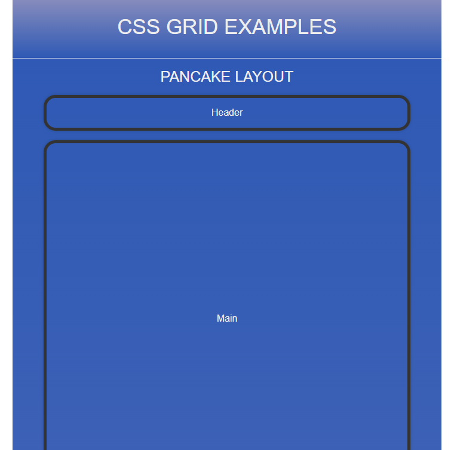
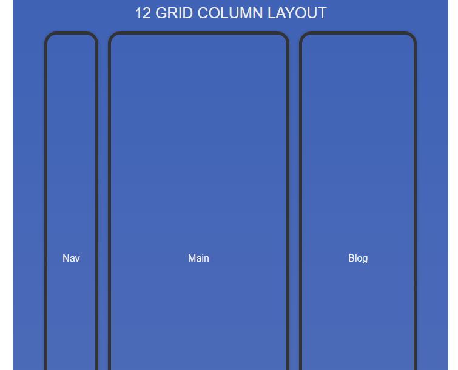
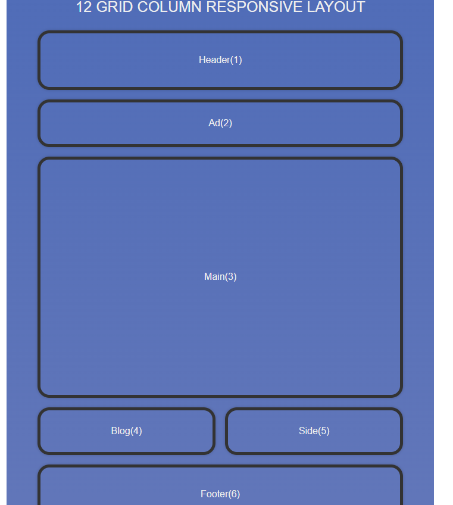
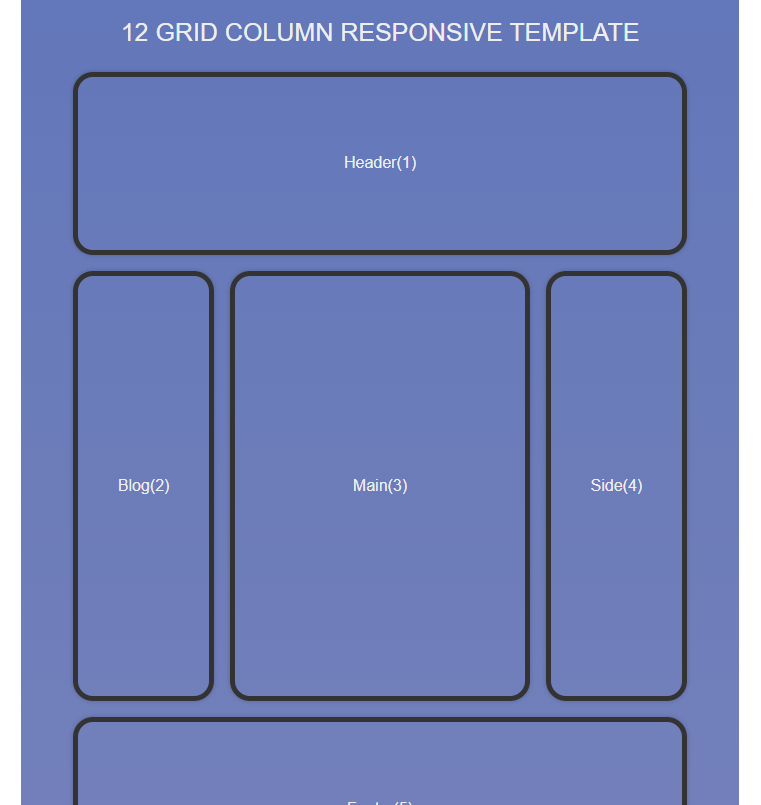
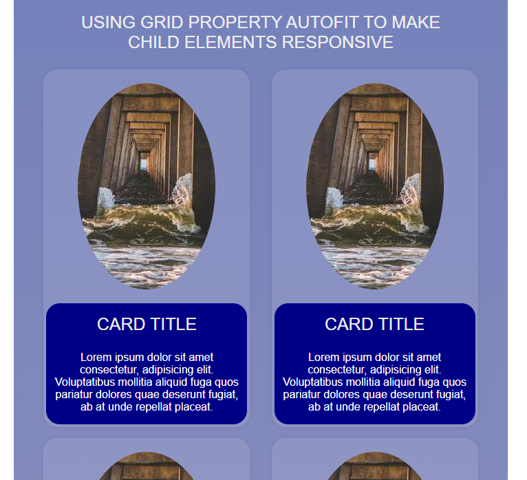

# TABLE OF CONTENTS

[Project Title](#project-title)
[Description](#description)
[Installation](#installation)
[Usage](#usage)
[Guidelines](#guidelines)
[Testing the Application](#testing-the-application)
[Github](#github)
[Contact Us](#contact-us)
[Licence](#licence)

## Project Title

CSS Grid Examples

## Description

This small project provides examples of using CSS Grids to better implement responsive layout designs for your own projects.

## Installation

There is no installation required when using this application.

## Usage

Open the index.html file in your browser of choice.

## Guidelines

There is no contribution needed.

## Testing the Application

You can either make your browser window responsive by minimising the browser window and dragging the sides - making the window size smaller, to see the layout change according to the size of the window.

## Github

https://github.com/Sho-ayb?tab=repositories

## Deployed Live

https://sho-ayb.github.io/css-grid-examples/

## Images of CSS Grid Examples

## Questions

Sho.ayb@outlook.com

## Licence

MIT License

Please click on the badge for more details on the licence.

